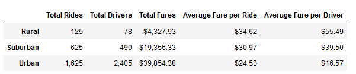
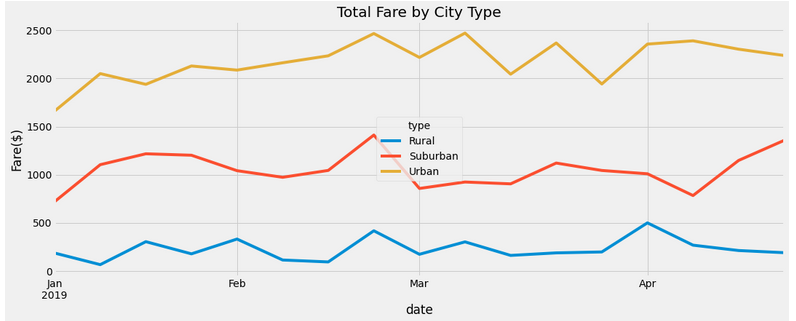

# PyBer_Analysis

## Overview
PyBer, a ride sharing company, requested a deep dive into their data. They requested a breakdown of weekly rides by city type (Urban, Suburban, Rural) along with a multi-line graph showing the total fares by week for each type of city. Using the python dependencies pandas and matplotlib, the data was easily filtered, cleaned, and plotted.

##Results
Initially, the two datasets given in .csv format were read into python and merged using the pandas library. Grouping by city type, the summary dataframe containing all the data can be seen below.

Based on this dataframe, Urban drivers have the lowest average fare per ride despite having a far higher total number of rides taken in Urban Cities. This is due to the much larger pool of total drivers in Urban areas. Conversely, there are far fewer total drivers in Rural areas, resulting in a much higher average fare per ride. As expected, suburban drivers have the second highest average fare and the second highest amount of total rides.

From here, new pivot tables and dataframes were created from the table above, grouping the data by the date and city type this time. With the index of the dataframe set to be the different weeks in which the rides all took place, the data was ready to create the multi-line chart showing the differences, shown below.

Based on the chart above, it can be seen that all of the city types have their peak weekly fares at the end of February. Throughout the spring months, Urban rides fluctuate but consistently were near the peak weekly fare, while the other two city types had their fares fall off until after April had begun. 

##Summary 

Three business recomendations for PyBer would be to include mileage data in the ride data to give a better sense of why the average fares are what they are for the different city types. Urban areas are more compact, so while they might be making less per ride on average, the sheer volume of rides compared to suburban and rural areas should more than make up for that. Secondly, PyBer should invest in marketing/PR for the early spring months in rural and suburban areas since the drop off in rides is significant. Lastly, a recommendation for PyBer is to potentially increase the amount of advertising for the company overall, to help increase the consistency of rides in all city types, reducing the size of the oscilations that can be seen in the multi-line chart.
